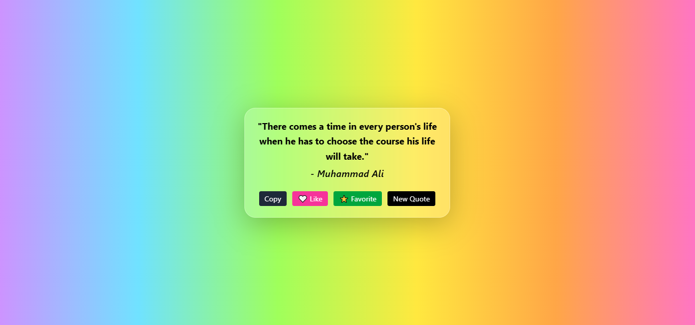
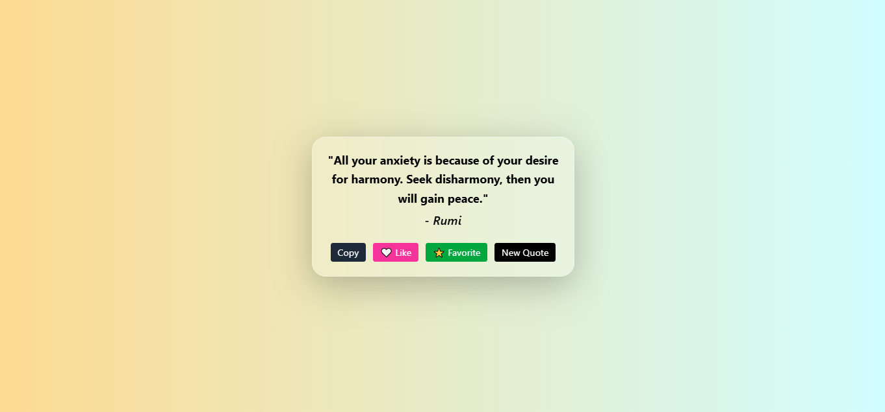
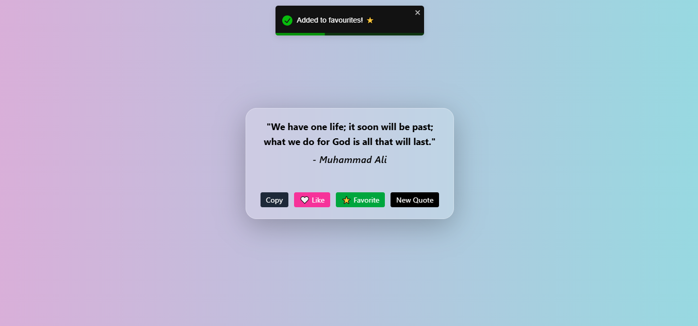

# 📝 Quotes Generator (React + DummyJSON API)

A modern and colorful Quotes Generator built using React, Tailwind CSS, and the DummyJSON Quotes API.

The application fetches random inspirational quotes and displays them inside a clean glassmorphism-inspired card. Every time a new quote is generated, the background transitions to a different gradient, creating a fresh and engaging user experience.

Built as a learning project to practice API integration, custom React hooks, component-based architecture, state management with hooks, localStorage, and responsive UI design.

---

## 📸 Preview

### Home Screen

### Quote Refresh & Dynamic Gradient

### Toast Notification

---

## 🚀 Features

- 📝 Fetch random quotes from the DummyJSON Quotes API
- 🔄 Generate a new quote with a single click
- 🎨 Dynamic gradient background rotation on every refresh
- 🧊 Modern glassmorphism-style quote card
- ⚛️ Custom React Hook (`useQuotes`) for reusable fetching logic
- 📋 Copy quotes directly to clipboard
- ❤️ Like quotes with interactive UI state
- ⭐ Save favorite quotes using localStorage
- 🔔 Toast notifications using React Toastify
- ⏳ Custom loading state with animated loader
- ❌ Error handling for failed API requests
- 📱 Responsive design for different screen sizes
- 🧩 Reusable component structure for better code organization

---

## 🛠️ Tech Stack

- React
- JavaScript (ES6+)
- Tailwind CSS
- React Toastify
- DummyJSON Quotes API
- Vite
- LocalStorage API

---

## 🧠 Concepts Practiced

- API Integration
- Custom React Hooks
- State Management with Hooks
- Component Reusability
- Conditional Rendering
- LocalStorage Persistence
- Event Handling
- Responsive UI Design
- User Feedback & Notifications

---

## 🎨 UI Highlights

- Multi-gradient animated backgrounds
- Clean and minimal interface
- Soft glassmorphism-inspired card
- Dynamic visual feedback
- Smooth user interactions
- Modern typography and spacing

